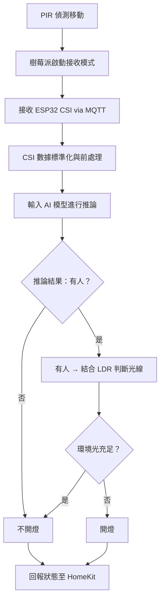

# HomePi 智慧照明控制系統

## 專案簡介

**HomePi** 是一個以 Raspberry Pi 為核心的智慧家庭照明控制系統，結合了 Wi-Fi CSI、PIR、LDR 與 AI 推論模型，實現一套低成本、可擴充、具備人物判斷能力的室內燈光控制解決方案。

本專案解決了 PIR 感測器無法偵測靜止人物的問題，並以 CSI（Channel State Information）輔助判斷房間內是否有人，提升整體燈光控制的準確性與智慧程度，並成功整合 HomeKit（透過 HomeBridge Plugin）支援 iPhone 語音與自動化操作。

---

## 系統特色

- **多感測器融合判斷**
  - PIR 檢測移動
  - LDR 感測環境光線
  - CSI 模型推論人物存在
- **AI 模型推論**
  - 使用 Bi-LSTM AutoEncoder 進行 CSI 異常偵測
- **HomeBridge Plugin**
  - 自行撰寫的 HomeBridge 插件 `index.js` 實現與 HomeKit 整合
- **MQTT 資料整合**
  - ESP32 實時推送 CSI 至 Raspberry Pi 處理與決策
- **省電策略**
  - 無人且光線充足時，自動關燈；反之則開燈

---

## 系統架構

### 主要元件：

- **ESP32**：透過 ESP-CSI SDK 傳送 CSI 數據至 Raspberry Pi
- **Raspberry Pi 4**：資料收集與推論處理主機
- **PIR 感測器**：判斷是否有移動
- **LDR 感測器**：判斷環境光亮度
- **繼電器**：控制燈泡開關
- **LED 燈泡**：模擬實際照明設備

---

## 功能流程（Mermaid 流程圖）

> 若 GitHub 無法直接顯示 Mermaid，建議使用支援的 Markdown 編輯器（如 Typora、Obsidian）檢視。

---

## 技術說明

### CSI 處理與模型訓練

- 使用 **ESP32** 收集 CSI 資料
- 特徵選擇：以 amplitude 的標準差 (STD) 為主特徵
- 模型結構：**Bi-LSTM AutoEncoder**
- 訓練策略：以「沒有人」狀態為正常樣本進行異常學習
- 推論邏輯：輸出 reconstruction error，若超過閾值 → 判定為「有人」
- 成功案例：最終測試環境下可穩定判斷靜止人物存在，並控制燈光

### HomeBridge Plugin 開發

- 自行撰寫 `index.js` 實現 HomeKit 整合
- 特點：
  - 自定義配件名稱、GPIO 腳位
  - 支援自動與手動切換
  - 支援 LDR 判斷 + CSI 輔助控制
  - 與 `predict.py` 結合進行推論判斷
- 搭配 `config.schema.json` 與 `package.json` 進行插件配置

### MQTT 整合

- ESP32 定期發送 CSI 至 `homepi/csi` 主題
- `index.js` 內建 MQTT client，接收資料後喚起 Python 模型推論
- 回傳結果控制燈光狀態，並同步回報給 HomeKit 狀態

---

## 開發環境

- **開發主機**：macOS + Raspberry Pi 4
- **感測設備**：ESP32 + PIR + LDR + Relay
- **語言與技術**：
  - ESP：C / ESP-IDF
  - Raspberry Pi：Python 3、MQTT、pigpio、joblib
  - HomeBridge Plugin：Node.js / JavaScript
- **模型格式**：`.pkl、.tflite`

---

## 最終成果與測試結果

- 系統最終可穩定運作，並成功：
  - 判斷靜止人物不關燈（例如站立不動 10 分鐘以上）
  - 無人後約 30 秒內自動關燈（測試結果約 38 秒）
- 測試情境包含：
  - 站立中間保持靜止
  - 躲在 ESP32 後方遮蔽情境
- 成功整合至 iOS 的 Home App，支援語音控制與狀態查詢

---

## 專案結語

這是一個完整且實作成功的智慧照明系統專題，從資料蒐集、模型訓練、感測整合、MQTT 通訊、到 HomeBridge Plugin 開發皆由本人獨立完成。

透過這個專題，我深度實作了 AIoT 系統的資料處理流程、機器學習模型部署與前後端整合能力，期待未來可進一步拓展為完整的智慧家庭解決方案。

---

## 備註

此專案以「作品展示」為主，並非開箱即用的開源框架。如需使用，請具備 ESP32 CSI 燒錄與 Raspberry Pi Python 環境建構經驗。

